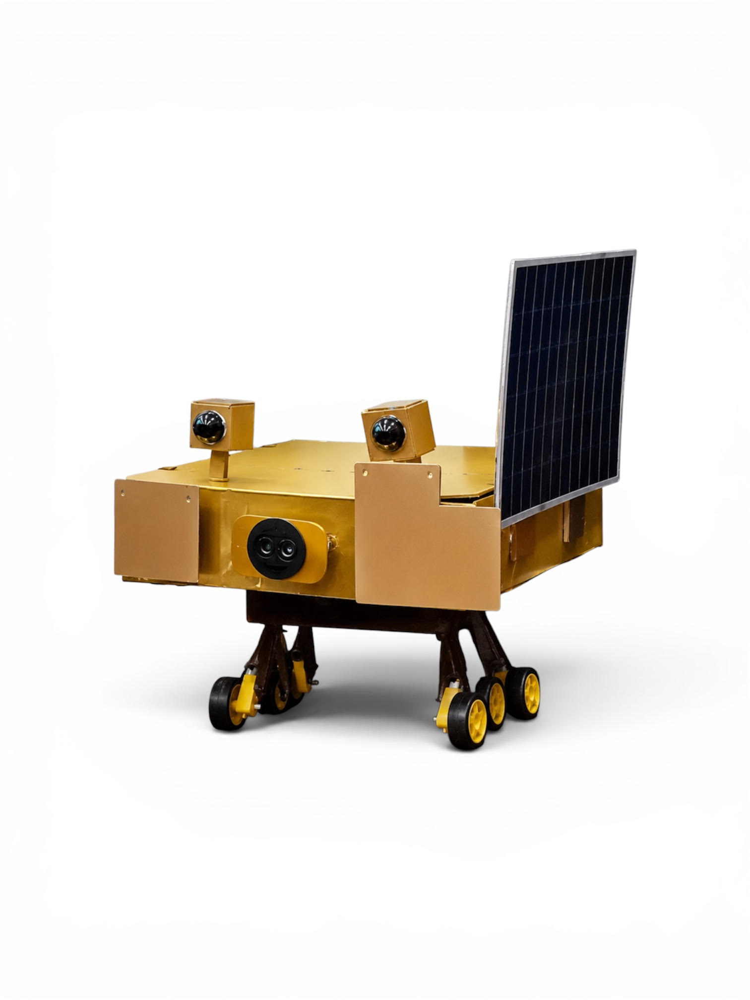

# Chandrayaan Rover

Obstacle avoidance rover inspired by the Chandrayaan mission, built as a client 
project under mentorship at Unschool Robotics Lab. Features an ultrasonic sensor 
for real time obstacle detection and autonomous navigation.

## ⚙️ How It Works
The ultrasonic sensor continuously measures distance to objects ahead. When an 
obstacle is detected within a set range, the Arduino Uno processes the signal and 
commands the L298N motor driver to steer the rover away allowing fully autonomous 
obstacle avoidance navigation.

## 🔧 Components
| Component | Purpose |
|---|---|
| Arduino Uno | Main microcontroller |
| Ultrasonic Sensor (HC-SR04) | Detects obstacles in path |
| L298N Motor Driver | Controls the drive motors |
| Sunboard Body (upper) | Custom built upper chassis |
| Laser Cut Lower Body | Pre-fabricated lower chassis (client provided) |

## Code
Code generated with AI assistance, reviewed and uploaded by me.

## Project Context
Built as a client project under mentorship at **Unschool Robotics Lab**. 
I was responsible for the full upper body construction, circuit design, 
wiring, and implementation.

## The Build

## Built At
**Unschool Robotics Lab** — as part of an integrated IGCSE program.

## Status
✅ Completed and assembled — May 2026
